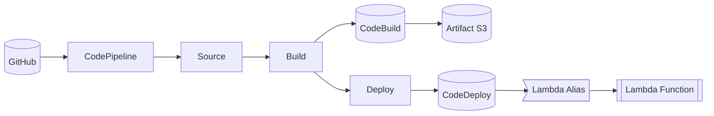
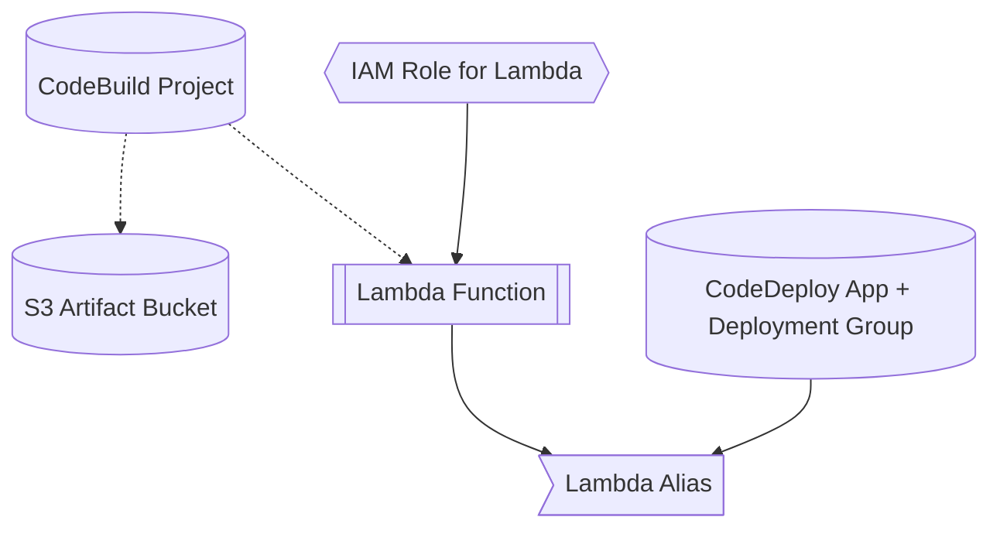

# python_Terraform_CICD_repo

## このリポジトリで構築できるもの

1. Terraform で dev 環境の S3 アーティファクトバケット、CodePipeline、CodeBuild、CodeDeploy、Lambda をまとめてプロビジョニングする。
2. GitHub `main` ブランチへの push をトリガーに CodePipeline が動き、Source → Build → Deploy の各ステージで Lambda エイリアス `live` を自動更新する。
3. CodeBuild が `infra/dev/buildspec.yml` に従い Lambda ZIP と `appspec.yml` を生成してアーティファクトバケットへ格納し、CodeDeploy が Blue/Green デプロイで切り替える。

## 事前に用意するもの

1. AWS CLI と `aws-vault`。ローカルに長期キーを置かないため必須。
2. `terraform-operator` という aws-vault プロファイル。対象アカウントのアクセスキーを登録済みであること。
3. Terraform v1.9 以降と Python 3.11 系。CodeBuild では Python 3.11 を利用するためローカルでも合わせておく。

## セットアップと Terraform 実行

1. リポジトリを取得して `infra/dev` へ移動する。
    ```bash
    git clone git@github.com:koichihatakeyama/python_Terraform_CICD_repo.git
    cd python_Terraform_CICD_repo/infra/dev
    ```
2. 初回はバックエンドを初期化する。
    ```bash
    aws-vault exec terraform-operator --no-session -- terraform init
    ```
3. 変更内容を確認するときのコマンド。
    ```bash
    aws-vault exec terraform-operator --no-session -- terraform plan
    ```
4. 実際に反映するときのコマンド。
    ```bash
    aws-vault exec terraform-operator --no-session -- terraform apply
    ```
5. CodePipeline を即時で動かしたいときのコマンド。
    ```bash
    aws codepipeline start-pipeline-execution \
      --region ap-northeast-1 \
      --name python-terraform-cicd-dev-pipeline
    ```

## CI/CD の流れ

1. GitHub push → CodePipeline の Source ステージが ZIP を取得する。
2. Build ステージで CodeBuild が `infra/dev/lambda_src` をコピーし `(cd package && zip -r ../lambda.zip .)` で成果物を作成する。`aws lambda update-function-code` 実行後は `aws lambda wait function-updated` で更新完了を待ち、`aws lambda publish-version` で新バージョンを取得する。
3. 同じビルドで `appspec.yml` を `echo` コマンドの連続で生成し（コロンを含む行は `'echo "Key: Value"'` のように必ずシングルクォートで囲む）、ZIP と一緒に S3 へ出力する。
4. Deploy ステージで CodeDeploy が S3 から ZIP と AppSpec を取得し、Lambda エイリアス `live` を Blue/Green 方式で更新する。

## ディレクトリ早見表

| パス | 役割 |
| --- | --- |
| `infra/dev/main.tf` | dev 環境の Terraform 定義（S3、CodePipeline、CodeBuild、CodeDeploy、Lambda など） |
| `infra/dev/buildspec.yml` | CodeBuild 手順。ZIP 作成、Lambda 更新、バージョン発行、AppSpec 生成までを一括で記述 |
| `infra/dev/lambda_src/handler.py` | デプロイ対象の Python Lambda。現在は疎通確認用のシンプルなレスポンス |
| `infra/modules` | 今後共有化したい Terraform モジュールを置く予定の場所 |
| `scripts/cleanup_dev.sh` | アーティファクト S3 と Terraform backend を空にした上で `terraform destroy` を実行し、課金リソースをまとめて削除するスクリプト |

## クリーンアップ（S3 内データごと削除）

1. コマンドはリポジトリルートで `./scripts/cleanup_dev.sh` を実行するだけ。`aws-vault exec terraform-operator --no-session -- ...` を内部で呼び出し、S3 成果物バケットの全オブジェクト削除 → `terraform destroy -auto-approve` → Terraform backend S3（`python-terraform-cicd-tfstate-dev`）と DynamoDB ロックテーブルの削除まで自動で進める。
2. 事前に `terraform apply` 済みで state が存在することが前提。未作成の状態で動かすと `artifact_bucket_name` 取得で停止する。
3. AWS プロファイルを変えたいときは `AWS_VAULT_PROFILE=my-profile ./scripts/cleanup_dev.sh` のように環境変数で上書きする。`AWS_REGION`、backend 名を変えたいときは `BACKEND_BUCKET` / `BACKEND_DYNAMODB_TABLE` / `BACKEND_REGION` で上書きすればよい。
4. スクリプト完了後は `.terraform/` ディレクトリと tfstate もローカルから除去されるため、追加の削除手順は不要。
5. 破壊的な操作なので、本当に検証環境を完全削除してよいか確認してから実行すること。

## 運用メモ

1. CodeBuild ロールには `lambda:GetFunctionConfiguration` を含めており、`aws lambda wait function-updated` が正しく動く。IAM を手で変更せず Terraform から管理すること。
2. CodeDeploy ロールには AWSCodeDeployRoleForLambda に加えて S3 読み取り用インラインポリシー（`aws_iam_role_policy.codedeploy_s3`）を付与している。アーティファクトバケット名を変えたら必ずここも更新する。
3. `aws-vault exec terraform-operator --no-session -- ...` の `--no-session` を外すと `InvalidClientTokenId` が発生するため、plan も apply も必ず同オプション付きで実行する。
4. buildspec のコマンドは POSIX シェルで実行されるので `pushd` など Bash 専用の構文は使わない。必要なら `(cd dir && ...)` 形式で書く。

## トラブルシューティング

1. buildspec の YAML エラーが出たら、コロンを含む `echo` 行をシングルクォートで囲めているか確認し、`python - <<'PY'` などで `yaml.safe_load` を流して検証する。
2. `aws lambda publish-version` で `ResourceConflictException` が出るときは `aws lambda wait function-updated` が挟まっているか、CodeBuild ロールに必要権限があるかを確かめる。
3. CodeDeploy が S3 にアクセスできないときは `aws_iam_role_policy.codedeploy_s3` の ARN が最新バケットに向いているか確認する。
4. CodePipeline で `codedeploy:RegisterApplicationRevision` エラーが出た場合は `aws_iam_role_policy.codepipeline` に同アクションが入っているかをチェックする。

## 今後の展望

1. GitHub Actions から Terraform を実行するための OIDC ロールを整備する。
2. stg や prod など複数環境へ展開できるよう `infra/modules` を整理し、tfvars 設計を固める。
3. Lambda の自動テストを CodeBuild フェーズへ組み込み、CI フロー内で品質ゲートを追加する。

## 参考アーキテクチャ





以上
