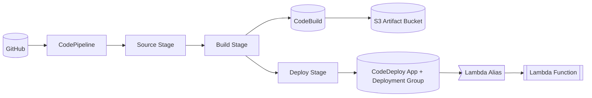

# python_Terraform_CICD_repo

## 目指したいゴール

TerraformでAWSの構成をコード化しつつ、Lambdaの本体はPythonで書く。
GitHubにpushしたタイミングで、CodePipeline→CodeBuild→Lambdaまで自動反映される形にする想定。

## 今イメージしている流れ

1. TerraformのコードとLambdaのコードを同じGitHubリポジトリで管理する。
2. GitHub ActionsからOIDCを使ってTerraform用のIAMロール（TerraformGitHubActionsRole）を引き受け、plan/applyを実行する。
3. TerraformがCodePipelineとCodeBuildを用意し、CodeBuildがLambdaのパッケージを作る。
4. ビルドした成果物をS3のアーティファクトバケットに置き、Lambdaへデプロイする。

## これから進めたいこと

- Terraformの構成やステート管理をどうするか決める。
- GitHub Actions、CodePipeline、CodeBuildを順番に整える。
- LambdaのPythonコードとテストの書き方をまとめる。

細かいところは作業しながら固める。

## インフラ構成メモ

### ゴールイメージ

### 現在の構成

### 差分メモ

- CodePipelineとSourceステージが未着手。
- Buildの実行経路はこれからつなぐ（現状は CodeBuild 単体想定）。
- CodeDeployはエイリアスを切り替える枠だけ作成済みで、パイプラインから呼ぶ部分が未実装。
